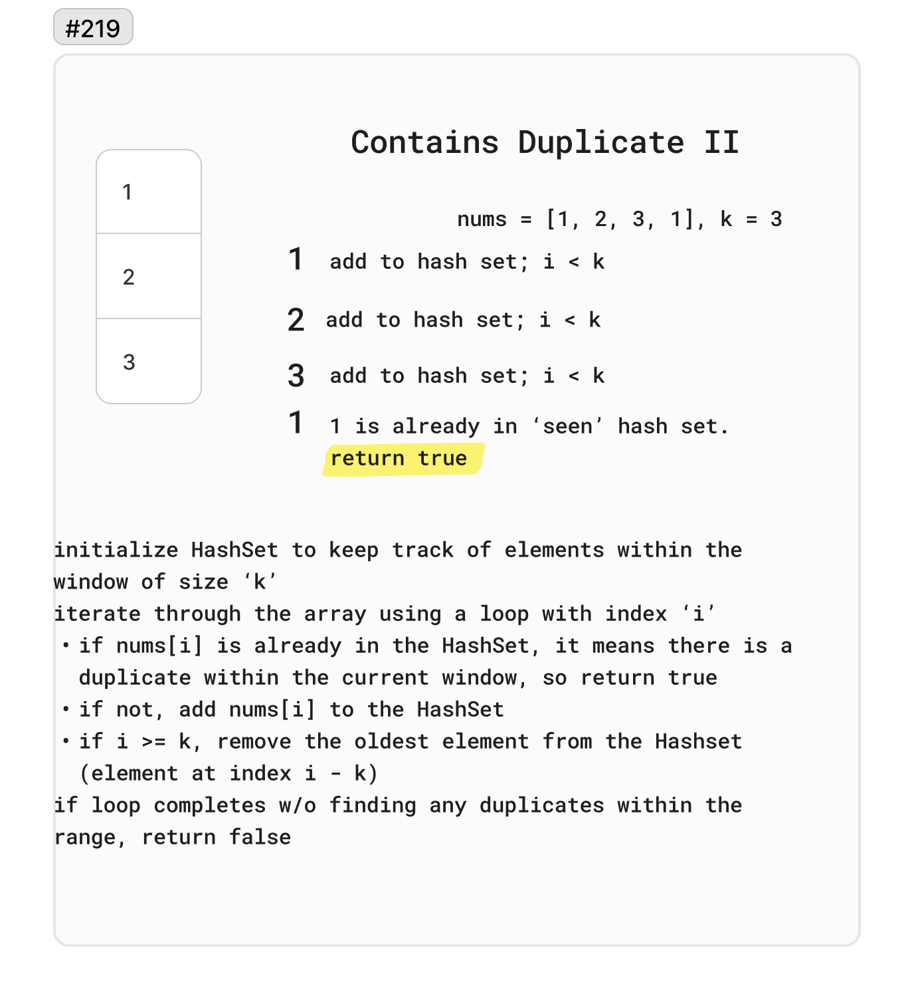

# 219 - Contains Duplicate II

Given an integer array nums and an integer `k`, return true if there are two distinct indices `i` and `j` in the array such that `nums[i] == nums[j] and abs(i - j) <= k`.

Example 1:

Input: `nums = [1,2,3,1], k = 3`
Output: `true`

Example 2:

Input: nums = `[1,0,1,1], k = 1`
Output: `true`

Example 3:

Input: nums = `[1,2,3,1,2,3], k = 2`
Output: `false`

## Whiteboard

## Solution

[ContainsDuplicateII.cs](../LeetCode/ContainsDuplicateII.cs)

## Big O

- Time complexity: `O(n)`: We iterate through the array once, and each lookup in the table costs only O(1) time.
- Space complexity: `O(min(n,k))`: The space complexity is O(min(n,k)) because in the worst case, the table will contain min(n,k) elements.