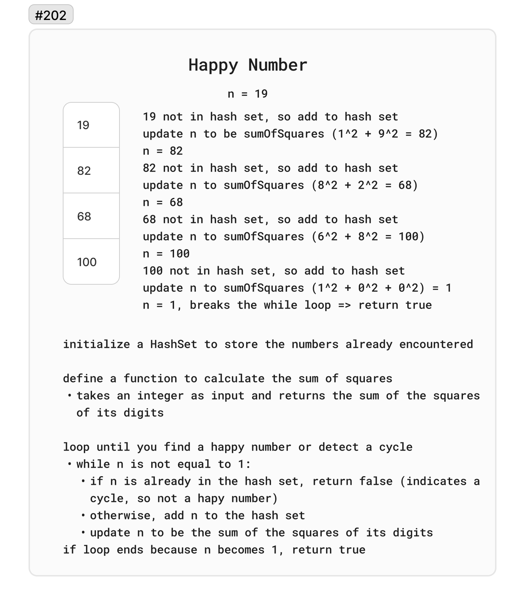

# 202. Happy Number

Write an algorithm to determine if a number `n` is happy.

A happy number is a number defined by the following process:

Starting with any positive integer, replace the number by the sum of the squares of its digits.
Repeat the process until the number equals 1 (where it will stay), or it loops endlessly in a cycle which does not include 1.
Those numbers for which this process ends in 1 are happy.

Return `true` if `n` is a happy number, and `false` if not.

Example 1:

Input: `n = 19`
Output: `true`

Explanation:
`12 + 92 = 82
82 + 22 = 68
62 + 82 = 100
12 + 02 + 02 = 1
`

Example 2:

Input: `n = 2`
Output: `false`

## Whiteboard

## Solution

[HappyNumber.cs](../LeetCode/HappyNumber.cs)

## Big O

### Time complexity:

- `sumOfSquares` function: `O(logn)`, where `n` is the value of the number at that step; Each iteration's cost is dominated by the time it takes to compute the sum of squares of the digits
- The `isHappy` function iterates over the process of transforming the number n into the sum of the squares of its digits until it either reaches 1 or detects a cycle.

### Space complexity:

- `O(logn)`: The HashSet stores the numbers encountered during the process. In the worst case, the HashSet could store each unique number generated until either 1 is reached or a cycle is detected.
- Although the HashSet grows with each unique number encountered, this growth is limited by the small size of the numbers the algorithm can generate. The space used by the HashSet is therefore bounded by a small constant, making the space complexity effectively constant.