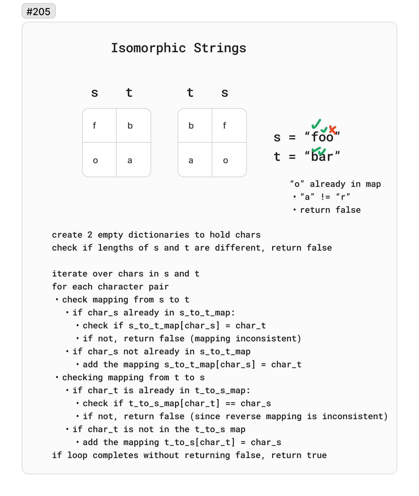

# 205 Isomorphic Strings

Given two strings `s` and `t`, determine if they are isomorphic.

Two strings `s` and `t` are isomorphic if the characters in s can be replaced to get `t`.

All occurrences of a character must be replaced with another character while preserving the order of characters. No two characters may map to the same character, but a character may map to itself.

 

Example 1:

Input: `s = "egg", t = "add"`
Output: `true`

Example 2:

Input: `s = "foo", t = "bar"`
Output: `false`

Example 3:

Input: s = `"paper", t = "title"`
Output: true

## Whiteboard

## Solution

[IsomorphicStrings.cs](../LeetCode/IsomorphicStrings.cs)

## Big O

- Time complexity: O(n) - In the worst case, the algorithm will scan through the entire string once, making the time complexity dependent on the length of the string. total number of iterations is therefore proportional to the length of the string.
- Space complexity: O(1)