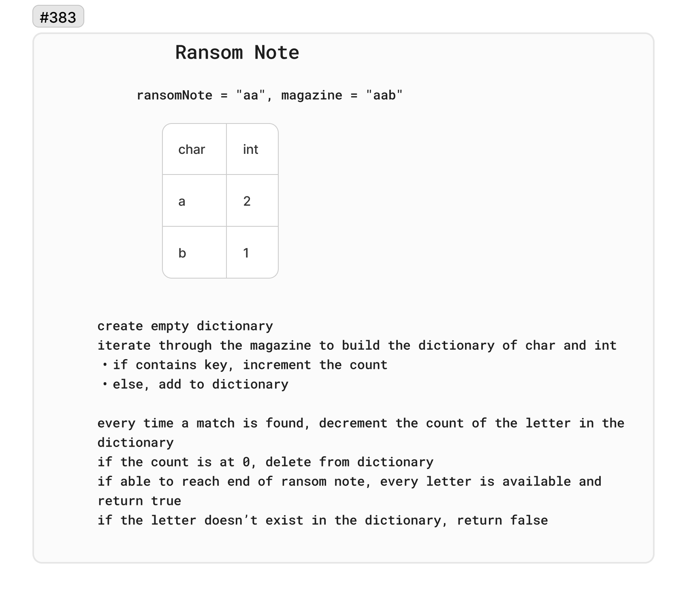

# 383. Ransom Note

Given two strings ransomNote and magazine, return true if ransomNote can be constructed by using the letters from magazine and false otherwise.

Each letter in magazine can only be used once in ransomNote.

 

Example 1:

Input: `ransomNote = "a", magazine = "b"`
Output: `false`

Example 2:

Input: `ransomNote = "aa", magazine = "ab"`
Output: `false`

Example 3:

Input: `ransomNote = "aa", magazine = "aab"`
Output: `true`

## Whiteboard

## Solution

[RansomNote.cs](../LeetCode/RansomNote.cs)

## Big O

- Time complexity: O(n) - In the worst case, the algorithm will scan through the entire string magazine once, making the time complexity dependent on the length of magazine. total number of iterations is therefore proportional to the length of magazine.

- Space complexity: O(1)