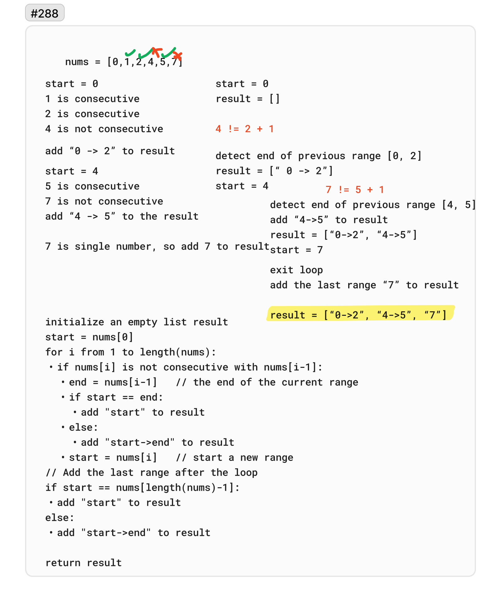

# 288. Summary Ranges

You are given a sorted unique integer array nums.

A range `[a,b]` is the set of all integers from a to b (inclusive).

Return the smallest sorted list of ranges that cover all the numbers in the array exactly. That is, each element of nums is covered by exactly one of the ranges, and there is no integer x such that x is in one of the ranges but not in nums.

Each range `[a,b`] in the list should be output as:

`"a->b"` if `a != b`
`"a"` if `a == b`
 

Example 1:

Input: `nums = [0,1,2,4,5,7]`
Output: `["0->2","4->5","7"]`

Explanation: The ranges are:
`[0,2] --> "0->2"``
[4,5] --> "4->5"`
`[7,7] --> "7"`

## Whiteboard

## Solution

[SummaryRanges.cs](../LeetCode/SummaryRanges.cs)

## Big O

- Time complexity: `O(n)`: We iterate through the array once.
- Space complexity: `O(n)`: We store the ranges in a list.