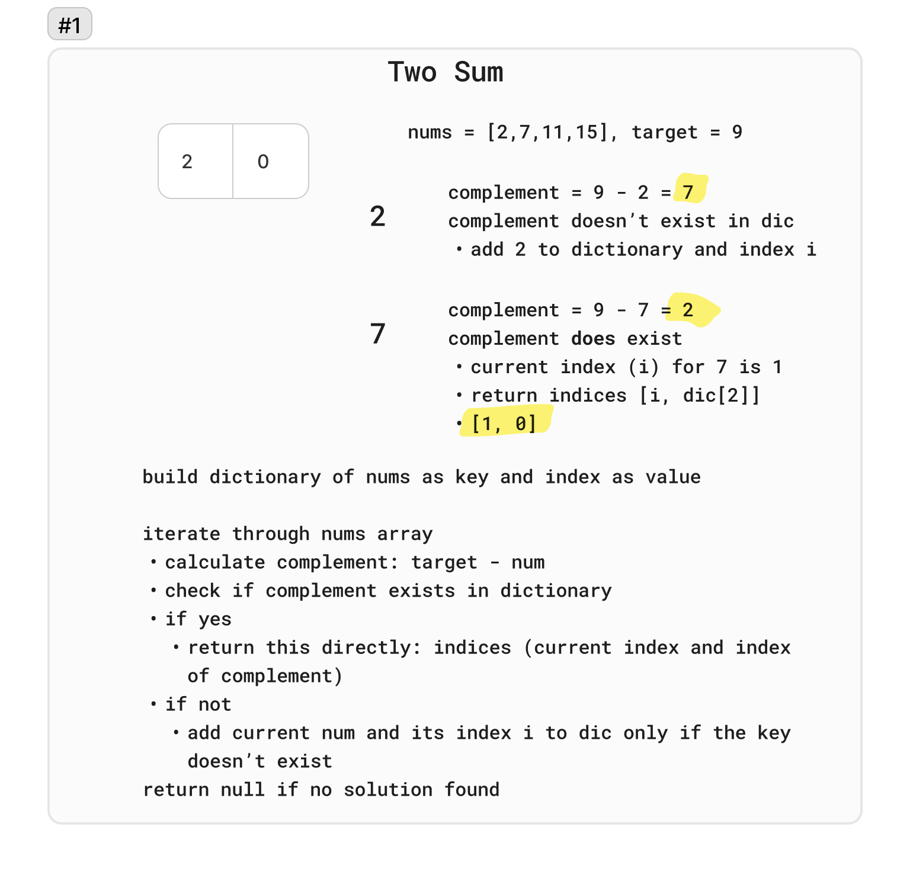

# 1. Two Sum

Given an array of integers nums and an integer target, return indices of the two numbers such that they add up to target.

You may assume that each input would have exactly one solution, and you may not use the same element twice.

You can return the answer in any order.

 

Example 1:

Input: `nums = [2,7,11,15], target = 9`
Output: `[0,1]`
Explanation: Because nums[0] + nums[1] == 9, we return [0, 1].

Example 2:

Input: `nums = [3,2,4], target = 6`
Output: `[1,2]`

Example 3:

Input: `nums = [3,3], target = 6`
Output: `[0,1]`

## Whiteboard

## Solution

[TwoSum.cs](../LeetCode/TwoSum.cs)

## Big O

- Time complexity: O(n) - We traverse the array containing `n` elements only once. Each look up in the table costs only O(1) time.
- Space complexity: O(n) - We need to store n elements in the dictionary.