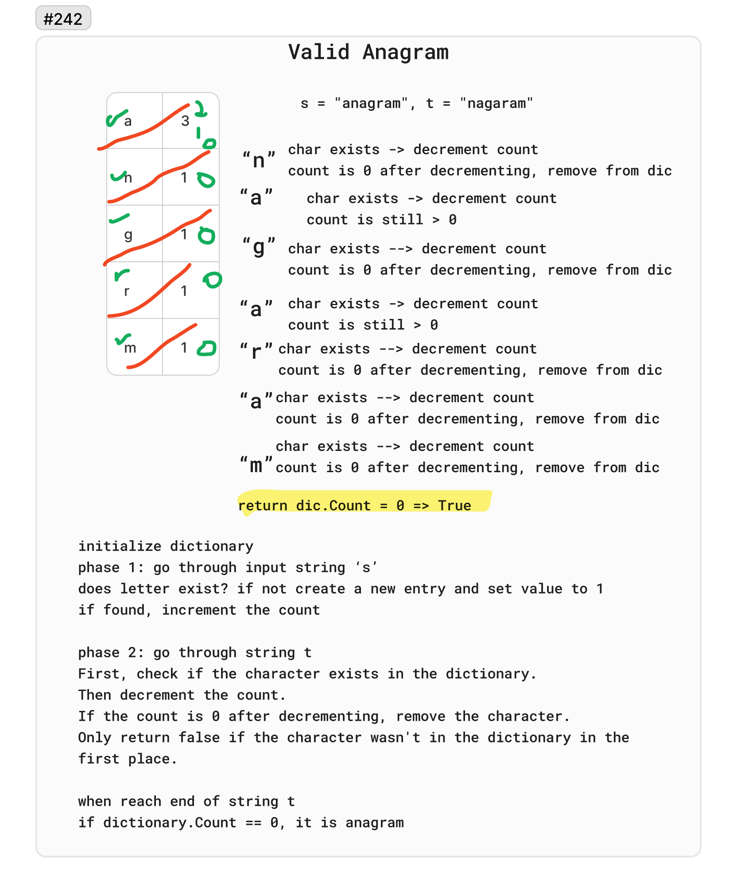

# 242. Valid Anagram

Given two strings `s` and `t`, return `true` if t is an anagram of `s`, and `false` otherwise.

An Anagram is a word or phrase formed by rearranging the letters of a different word or phrase, typically using all the original letters exactly once.

Example 1:

Input: `s = "anagram", t = "nagaram"`
Output: `true`

Example 2:

Input: `s = "rat", t = "car"`
Output: `false`

## Whiteboard

## Solution

[ValidAnagram.cs](../LeetCode/ValidAnagram.cs)

## Big O

- Time complexity: O(n) - In the worst case, the algorithm will scan through the entire string once, making the time complexity dependent on the length of the string. total number of iterations is therefore proportional to the length of the string.
- Space complexity: O(1)