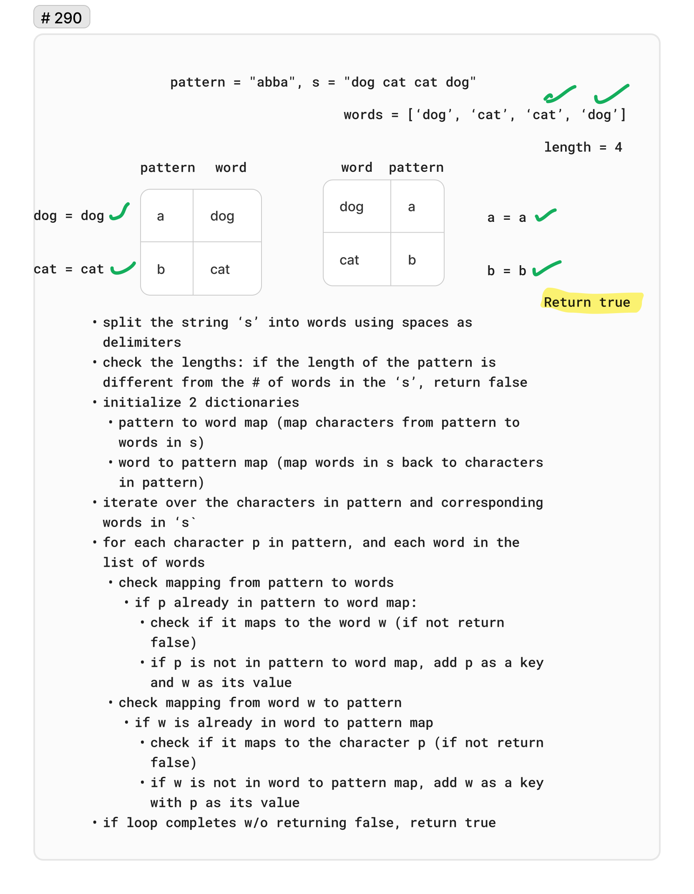

# 290. Word Pattern

Given a `pattern` and a string `s`, find if `s` follows the same pattern.

Here follow means a full match, such that there is a bijection between a letter in pattern and a non-empty word in `s`.

 

Example 1:

Input: `pattern = "abba", s = "dog cat cat dog"`
Output: `true`

Example 2:

Input: `pattern = "abba", s = "dog cat cat fish"`
Output: `false`

Example 3:

Input: `pattern = "aaaa", s = "dog cat cat dog"`
Output: `false`

## Whiteboard

## Solution

[WordPattern.cs](../LeetCode/WordPattern.cs)

## Big O

- Time complexity: O(n) - In the worst case, the algorithm will scan through the entire string once, making the time complexity dependent on the length of the string. total number of iterations is therefore proportional to the length of the string.
- Space complexity: O(n) - The space complexity is O(n) because we are storing the words in a dictionary. The space complexity is proportional to the length of the string.